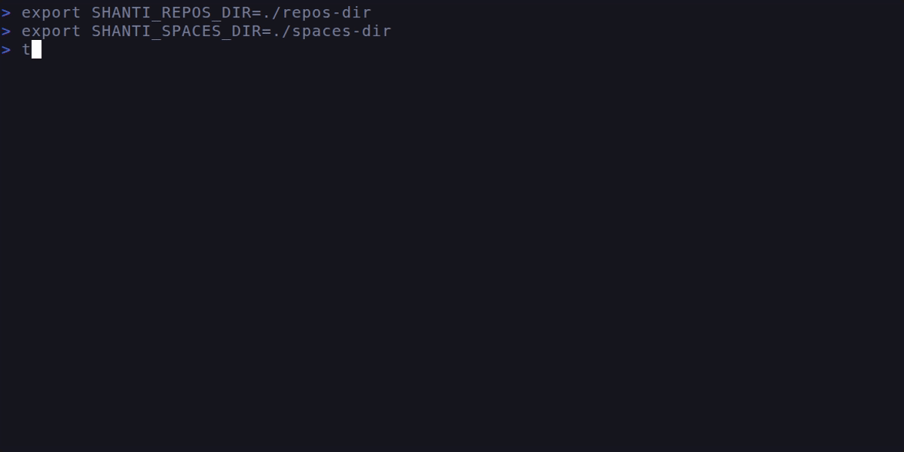

<h1 align="center">Shanti</h1>
<p align="center"><i>(Shanti: means peace of mind)</i></p>
<p align="center">
  CLI tool to create and manage git worktrees and jujutsu workspaces in multiple repositories.
</p>

<p align="center">
  <a href="#features">Features</a> •
  <a href="#installation">Installation</a> •
  <a href="#usage">Usage</a> •
  <a href="#configuration">Configuration</a> •
  <a href="#roadmap">Roadmap</a><br>
</p>



# Features

- **Manage spaces** — create, delete, and navigate git worktrees and jujutsu workspaces across different repositories.
- **Both backends, one list** — shanti detects per repository whether it is driven by git or by jj, and each row says which backend owns it.
- **Status indicators** — every space shows two glyphs: one for its relationship to the upstream, one for its local state. See [Status indicators](#status-indicators).
- **Create spaces from PR links** — paste a GitHub PR URL and shanti clones the repo and creates a space from the PR branch (requires `gh` CLI or read-only `GITHUB_TOKEN`).
- **Configuration file** — a TOML file under `~/.config/shanti/`, layered with environment variables and CLI flags.
- **Vi-style navigation**

# Rationale

It simplifies working in multiple repositories, and multiple PRs in each repository. Where each PR has a separate space for ease of switching between the PRs.

The idea is to simplify context switching between open PRs by having all the spaces visible and manageable in single place.

`shanti` scans one or more repositories directories (`SHANTI_REPOS_DIR`) for repositories, and stores spaces under a separate directory (`SHANTI_WORKTREES_DIR`).

```
.
├── work_repos_dir/           # work repositories
│   ├── backend-repo/
│   └── frontend-repo/
├── personal_repos_dir/       # personal repositories
│   └── side-project/
└── worktrees_dir/            # spaces managed by shanti
```

Assume, there is a new feature to add a button in the UI, and that button requires a new endpoint in the backend. Spaces can be created as below:
- In the `frontend-repo`, create a new space named `add-new-button-to-the-ui`.
- and, in the `backend-repo`, create a new space named `add-backend-api-for-the-new-button`.

When these spaces are created in `shanti` they will be stored under the `worktrees_dir` as below:

```
└── worktrees_dir/
    ├── backend-repo/
    │   └── add-backend-api-for-the-new-button/   # checked-out space
    │       ├── src/
    │       └── ...
    └── frontend-repo/
        └── add-new-button-to-the-ui/             # checked-out space
            ├── src/
            └── ...
```

To switch between the spaces, run `cd $(shanti)` to go the directory of the selected space.

# Spaces: worktrees and workspaces

A **space** is one checked-out directory of a repository that you can work in independently of the others. It is the one word shanti uses for both backends, because each calls it something different:

| backend | what a space is | created with |
| --- | --- | --- |
| git | a worktree | `git worktree add` |
| jujutsu | a workspace | `jj workspace add` |

If you have never used jj: a **workspace** is jj's answer to the same problem a git worktree solves. One repository, several working copies, each with its own working-copy commit, all sharing the same history. So you can keep one workspace per PR and switch between them by changing directory — no stashing, no second clone.

A jj workspace differs from a git worktree in ways you will see in shanti:

- **jj auto-commits.** There is no "dirty working tree" in a jj space: your edits are already recorded in the working-copy commit. That is why the local status glyphs differ per backend (see below).
- **A jj space has a name, not a branch.** In a git repository the name you type is a branch name, and shanti creates the branch (from `origin/<name>` if it exists, else the default branch, else `HEAD`). In a jj repository it is the workspace's name: shanti creates it with `jj workspace add --name <name>` and does not create a bookmark for you. If a bookmark of that name already exists on a remote, the new workspace starts from it (and shanti starts tracking it); otherwise it starts on top of `trunk()`, jj's own name for the repository's mainline.
- **Deleting is safer.** Before forgetting a workspace, shanti lets jj snapshot it, so whatever was on disk becomes a real change in the repository. The directory goes away, the work stays reachable from `jj log`.

## How the backend is chosen

Repositories are found by scanning the repositories directories, and the backend is decided from what is on disk:

- `.jj` present → **jujutsu**.
- `.git` only → **git**.
- **Both** (a *colocated* repository) → jj owns it, because jj owns the working copy there and running git behind its back leaves jj's view of it stale. New spaces are created as jj workspaces. Git worktrees that already exist in that repository are still listed, and still acted on through git — each row names the backend that owns it.

The backend is never a setting you pick; it follows the repository.

## jujutsu requirements

shanti drives jj through the `jj` **command-line tool**, not a linked library. That is deliberate: you can upgrade jj whenever you like without rebuilding shanti.

- **jj 0.28.0 or newer** is required. An older jj is reported up front, with a message telling you to upgrade, rather than failing later inside a template parse.
- `jj` is looked up on `PATH`. Set `SHANTI_JJ_BIN` to an executable if yours lives elsewhere (a nix profile, a custom build).
- If you do not use jj at all, none of this applies: no jj repositories will be found and `jj` is never run.

## Status indicators

Each space shows two glyphs. The first is its relationship to the upstream and means the same for both backends; the second is local state, where the backends genuinely differ. A blank second slot means there is nothing worth saying.

**Upstream** (a git branch, or a jj bookmark):

| glyph | meaning |
| --- | --- |
| `✔` | in sync with upstream |
| `↑` | ahead of upstream |
| `↓` | behind upstream |
| `↕` | diverged from upstream |
| `✘` | upstream is gone (merged or deleted) |
| `⬆` | never pushed |
| `·` | not checked yet |

**Local state:**

| glyph | backend | meaning |
| --- | --- | --- |
| `*` | git | uncommitted changes |
| `!` | jj | the change has conflicts |
| `≠` | jj | the change is divergent |
| `∅` | jj | the working copy is empty |
| `·` | either | not checked yet |

The same legend is in the in-app help popup (`?`).

# Installation

Download the binary from the releases or clone the repo and inside the root directory run:
`cargo install --path . --locked`

Typicall, the binary will be installed in `$HOME/.cargo/bin/shanti`.

For jujutsu repositories, install [jj](https://jj-vcs.github.io/jj/) 0.28.0 or newer as well.

# Usage

Run `cd $(shanti)` in `bash`/`zsh` or `cd (shanti)` in `fish` shell from any directory with the below CLI options, or define the environment variables or the configuration file and run it without any CLI option:

- `-r`, `--repos-dir`: one or more directories where repositories are stored, colon-separated (or set `SHANTI_REPOS_DIR`, e.g. `/path/a:/path/b`). Can be repeated: `--repos-dir /a --repos-dir /b`. An entry that does not exist is skipped with a warning; only an empty list is an error.
- `-d`, `--worktrees-dir`: the directory where the spaces will be stored (or set `SHANTI_WORKTREES_DIR`). It is created if it is missing.
- `-f`, `--run-fetch`: fetch every repository at startup (or set `SHANTI_RUN_FETCH`).
  Meant for scripted use; interactively, `f` fetches just the repository you are
  looking at, when you want it.
- `--config <FILE>`: read this configuration file instead of the default one.
- `--show-config`: print the effective configuration, and where each value came from, then exit.
- `--no-hooks`: skip the [post-create hooks](#post-create-hooks) for this run (or set `SHANTI_NO_HOOKS` to any non-empty value).

## Keybindings

`shanti` uses vi-style keybindings. Check them with `?`

| key | action |
| --- | --- |
| `j` / `↓`, `k` / `↑` | move down / up |
| `g` / `Home`, `G` / `End` | go to first / last |
| `i` or `/` | filter mode (`Esc` leaves it) |
| `Tab` | toggle filter / list |
| `n` | new space (pick a repository) |
| `p` | new space from a GitHub PR URL |
| `P` | same, cloning the repository if it is missing |
| `r` | refresh: re-read every known repository's spaces and status (no network) |
| `R` | rescan the repos dirs, picking up repositories added or removed since launch |
| `f` | fetch the remotes of the selected space's repository, and only that one |
| `d` / `D` | delete with confirmation / force delete |
| `Enter` | print the path of the selected space and exit |
| `?` | help |
| `q` / `Ctrl+C` | quit |

# Configuration

Settings come from four layers. Later layers win:

1. built-in defaults,
2. the configuration file,
3. environment variables,
4. command line flags.

`shanti --show-config` prints the winner of each setting *and* the layer it came from, so "why is it using that directory?" never needs a look at the code:

```
config file: /home/you/.config/shanti/config.toml (loaded)

worktrees_dir  = /home/you/worktrees  (config file)
repos_dirs     = /home/you/src  (command line)
                 /home/you/work
run_fetch      = false  (built-in default)
backend        = git  (built-in default)
editor         = <unset>  (built-in default)
hooks          = 1 file(s) copied, 2 command(s), 1 repo(s) with their own  (config file)
```

## Configuration file

TOML, at `<config dir>/config.toml`. The config directory is `$XDG_CONFIG_HOME/shanti` when `XDG_CONFIG_HOME` is set, and `~/.config/shanti` otherwise. `SHANTI_CONFIG` overrides that directory outright, and `--config` overrides the file path for a single run. A missing file simply means "use the defaults"; a malformed one is an error naming the file and the offending key.

```toml
repos_dirs = ["~/src", "~/work"]
worktrees_dir = "~/worktrees"
run_fetch = true
```

`~` is expanded, and paths are resolved the same way no matter which layer they were written in.

Two further keys, `backend` (`"git"` / `"jujutsu"`) and `editor`, are accepted by the file and shown by `--show-config`, but nothing acts on them yet: the backend is decided from the repository on disk, and there is no editor integration.

## Post-create hooks

A new space is a fresh checkout, so everything your project needs but does not version — an ignored `.env`, an `.envrc` `direnv` has to allow, `node_modules` — is missing. Describe that setup once and `shanti` does it every time it creates a space:

```toml
# Runs after every space, in every repository.
[hooks]
copy = [".env", ".envrc"]          # carried over from the repository
run = ["direnv allow"]             # run in the new space, in order, after the copies

# Runs after a space of this repository only, on top of the global hooks above.
[repos.my-app.hooks]
run = ["npm ci"]
```

- **`copy`** lists paths relative to the repository root. A path that is not there is skipped, not an error: a `.env` nobody has written yet is the normal case. Directories are refused — copy hooks carry files.
- **`run`** lists shell command *lines*, run with the new space as the working directory. Nothing is interpolated into them; every value arrives as an environment variable instead: `SHANTI_SPACE_PATH`, `SHANTI_SPACE_NAME`, `SHANTI_REPO_PATH`, `SHANTI_REPO_NAME` and `SHANTI_BACKEND` (`git` or `jj`).
- Global hooks run first, then the repository's own, so a general rule is stated once and specialised. A repository is keyed by its directory name, or by its absolute path (`[repos."/home/you/src/my-app".hooks]`) when two checkouts share a name.

Hooks run **in the background**: the list stays usable and shows `setting up` while they work. A hook that fails never costs you the space — it is already created and listed — and says so on the status line, naming the step that broke; the command's output goes to the log file. Success is silent.

Hooks are only ever read from **your own** configuration file. `shanti` never runs a hook shipped inside a repository, so cloning a repository is not a code-execution path. `--no-hooks` (or `SHANTI_NO_HOOKS=1`) skips them all for one run.

## Environment variables

| Variable               | CLI flag          | Description                                                       |
| ---------------------- | ----------------- | ----------------------------------------------------------------- |
| `SHANTI_REPOS_DIR`     | `--repos-dir`     | Colon-separated directories containing repositories                |
| `SHANTI_WORKTREES_DIR` | `--worktrees-dir` | Directory where spaces are created                                 |
| `SHANTI_RUN_FETCH`     | `--run-fetch`     | Fetch every repository at startup                                  |
| `SHANTI_CONFIG`        | `--config`        | Directory holding `config.toml` (the flag names the file itself)   |
| `SHANTI_JJ_BIN`        | —                 | Path to the `jj` binary, when it is not on `PATH`                  |
| `SHANTI_DATA`          | —                 | Directory for shanti's log file (default `~/.local/state/shanti`)  |
| `SHANTI_LOGLEVEL`      | —                 | Log level, e.g. `debug` (`RUST_LOG` takes precedence)              |
| `SHANTI_NO_HOOKS`      | `--no-hooks`      | Skip every post-create hook for this run (any non-empty value)     |
| `GITHUB_TOKEN`         | —                 | Read-only token for the GitHub PR flow                             |

# GitHub PR spaces

`p` asks for a GitHub PR URL and creates a space for the PR's branch; `P` does the same and clones the repository first if it is not already in one of the repositories directories. PR details are read through the `gh` CLI when it is available, otherwise over HTTPS with `GITHUB_TOKEN`.

A clone made this way is always a plain **git** clone, even if you use jj everywhere. `jj git clone` would need a new-enough jj on every machine, and a clone is the moment a repository's shape is decided — deciding it for someone who never chose jj is not shanti's call. Adopting jj afterwards costs nothing: run `jj git init --colocate` in the clone and shanti drives it through jj on the next scan.

# Roadmap

- [x] Create new spaces.
- [x] Delete spaces.
- [x] Show the status of spaces (e.g. stale, active ...etc.).
- [x] Create spaces from remote branches.
- [x] Jujutsu workspaces alongside git worktrees.
- [x] Configuration file.
- [ ] Create PRs from spaces.
- [ ] Add metadata to spaces, e.g. JIRA links, PR links ...etc.
